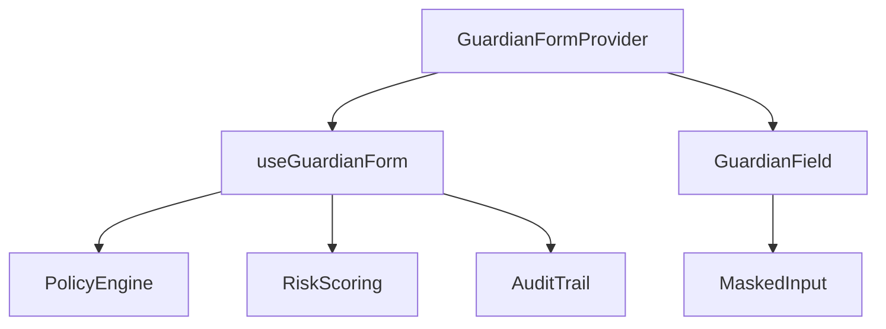

# @starterdev/guardian-form

Enterprise React + TypeScript form framework for regulated environments.

## Features

- **Field-level Data Classification**: Governance for various sensitivity levels:

  | Level | Description |
  | :--- | :--- |
  | `PUBLIC` | Non-sensitive data. |
  | `INTERNAL` | Proprietary but not personally identifiable. |
  | `PERSONAL` | PII (Personally Identifiable Information). |
  | `FINANCIAL` | Payment or banking details. |
  | `HIGHLY_SENSITIVE` | SSNs, SINs, or biometrics. |
- **Real-time Risk Scoring**: Instant feedback on form risk density.
- **Compliance Policy Engine**: Enforce security rules (e.g., "No Plaintext PII", "Require Encryption").
- **Audit Trails**: Built-in tracking of sensitive data access and modifications.
- **Headless-first**: Logic-heavy core with optional premium UI components.
- **Zod Support**: First-class adapter for schema-based validation.

## Installation

```bash
npm install @starterdev/guardian-form
```

## Quick Start

```tsx
import { 
  GuardianFormProvider, 
  GuardianField, 
  MaskedInput, 
  RiskMeter, 
  ComplianceSummary,
  DataClassification,
  NoPlaintextPiiPolicy,
  RequireEncryptionPolicy
} from '@starterdev/guardian-form';
import { z } from 'zod';
import { zodAdapter } from '@starterdev/guardian-form/adapters';

const schema = z.object({
  email: z.string().email(),
  ssn: z.string().min(9),
});

export function SecureForm() {
  return (
    <GuardianFormProvider
      initialValues={{ email: '', ssn: '' }}
      validate={zodAdapter(schema)}
      policies={[NoPlaintextPiiPolicy, RequireEncryptionPolicy]}
      userContext={{ userId: 'user-123', role: 'admin' }}
      onSubmit={(values) => console.log('Secure submission:', values)}
    >
      <GuardianField 
        name="email" 
        label="Email Address" 
        classification={DataClassification.PERSONAL}
      >
        {({ field }) => <input {...field} className="gf-input" />}
      </GuardianField>

      <GuardianField 
        name="ssn" 
        label="Social Security Number" 
        classification={DataClassification.HIGHLY_SENSITIVE}
        masked
        encryptionRequired
      >
        {({ field }) => <MaskedInput {...field} highlySensitive />}
      </GuardianField>

      <RiskMeter />
      <ComplianceSummary />
      
      <button type="submit" className="gf-submit-btn">Submit Governed Data</button>
    </GuardianFormProvider>
  );
}
```

## Architecture

GuardianForm is built on a headless core that centralizes governance logic, allowing you to use your own UI while benefiting from enterprise-grade security.



### Core Components

- **`GuardianFormProvider`**: The state management coordinator. It provides a React Context that tracks field metadata, values, and compliance status.
- **`GuardianField`**: A metadata wrapper. It registers fields with the governance engine, specifying their classification level and security requirements.
- **`useGuardianForm`**: The headless hook for custom form implementations. It returns methods for value updates, submission handling, and real-time compliance results.

### Security Mechanisms

1.  **Strict Masking**: The `MaskedInput` uses non-interactive visual masking to ensure sensitive data (like SSNs) aren't visible to shoulder-surfers, while maintaining the underlying value for encrypted submission.
2.  **Compliance Blocking**: Submission is automatically blocked if any `BLOCK` level policy violation is detected (e.g., trying to submit PII without encryption).

## Policy System

GuardianForm uses a pluggable policy engine. You can define custom rules:

```typescript
const MyCustomPolicy = {
  id: 'no-gmail',
  name: 'No Gmail',
  evaluate: (value, meta) => {
    if (meta.classification === 'INTERNAL' && value.includes('gmail.com')) {
      return { 
        ruleId: 'no-gmail', 
        message: 'Internal data cannot use public email providers.', 
        severity: 'BLOCK' 
      };
    }
    return null;
  }
};
```

## Risk Scoring

The risk score (0-100) is calculated based on:
- **PII Weight**: Assigned based on field classification levels.
- **Validation Penalty**: Incorrect or missing data in governed fields.
- **Free Text Density**: Heuristics for unstructured sensitive data.

## Enterprise Use Cases

- **Banking Onboarding**: Enforce KYC data encryption and PII masking.
- **Healthcare Intake**: Audit every touch of patient record fields.
- **Regulatory Reporting**: Ensure data retention policies are metadata-tagged.

## License

MIT
